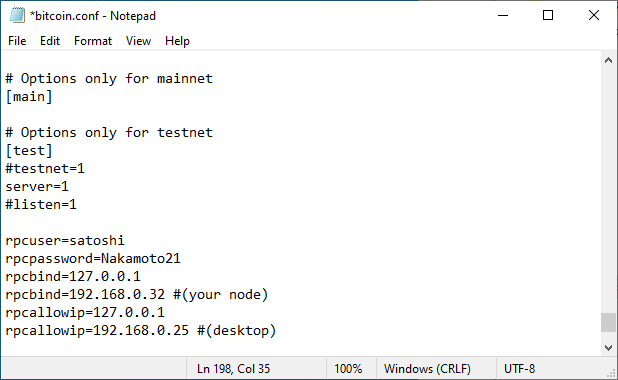
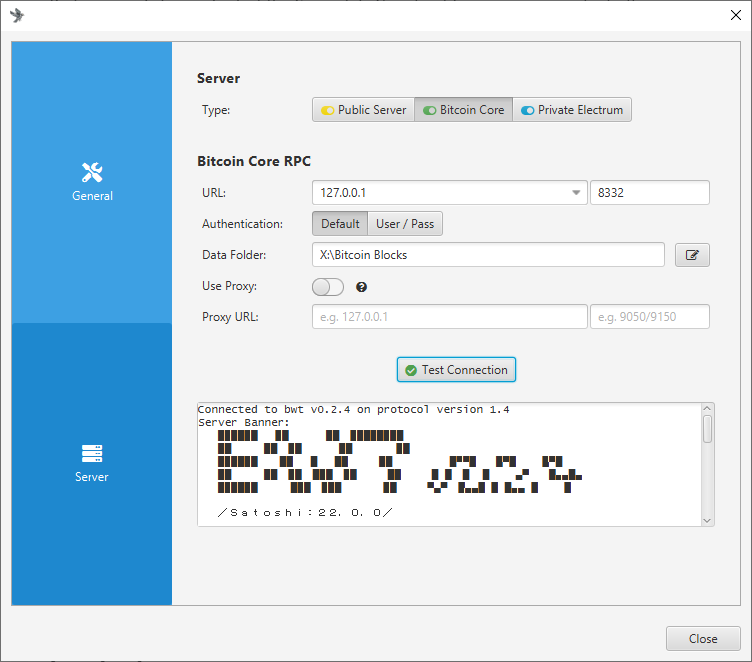
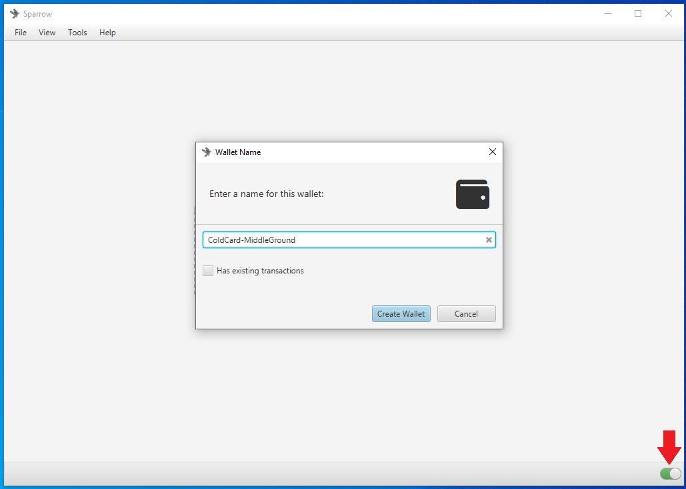
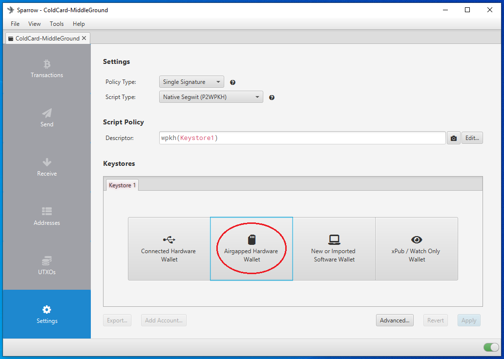

# ColdCard Middle Ground Guide
A middle ground guide for intermediate users to get started with a secure air-gapped cold storage wallet and a private desktop wallet. 

  

This guide covers:
- Checking the tamper-evident bag
- Setting up a PIN
- Generating a seed phrase with some dice rolls
- Air-gapped communication between ColdCard and [Sparrow Wallet](https://www.sparrowwallet.com/)
- Backup recommendations

## Checking the tamper-evident bag:
Upon receiving your ColdCard, ensure that the tamper-evident bag has not been compromised. If anything seems amiss or if you have any problems contact [support@coinkite.com.](mailto:support@coinkite.com?subject=%5BContact%5D%20-%20) Visually inspect the surfaces and edges of the bag for indications of tampering, openings, or damage.

  
  

  
  

You will see the tamper-evident words "void" appear when the seal is opened. Inside you will find your new ColdCard, the Wallet Recovery Backup Card, sticker(s), and an additional copy of the bag number which should match the bag number printed on the outside of the bag. 

  
  

If everything looks good, then you are ready to power on your new ColdCard and get it setup. 

## Setting up a PIN
Here is a diagram you can reference to learn the ColdCard's navigation:

  

A great security feature of the ColdCard is that it can be used completely air-gapped. Meaning that you never have to connect it to a computer, although that option is there if you choose to use it. You can use a standard USB outlet transformer or even a 9v battery with the ColdPower adaptor, which CoinKite offers [here](https://store.coinkite.com/store/cldpwr). To power on the ColdCard simply connect a USB to micro-USB [cable](https://store.coinkite.com/store/category/accessories) to the port on top of the ColdCard and the other end to a USB port on your ColdPower adaptor & 9v battery.

  
  

Once powered on, first read and accept the terms of sale & use. Then you will be asked to confirm the bag number. If there are any discrepancies, contact [support@coinkite.com](mailto:support@coinkite.com?subject=%5BContact%5D%20-%20).

  

Make careful considerations with your PIN number. You don't want to use one that is easy to guess. Your PIN will have two parts, a prefix and suffix. The idea is that once you enter the prefix, you will be presented with two anti-phishing words. If the words are the same as the words that were originally presented to you at initial startup, then you know that your ColdCard has not been tampered with since the last time you accessed it. 

First, select "Choose PIN Code", then you will see a brief description of how the PIN code works. Each part of your PIN code can be between 2 and 6 digits. There is absolutely no way to access a forgotten or lost PIN. Also, if you enter a PIN incorrectly too many times, it will brick your ColdCard as a security feature.

  

After hitting "OK" you will get one more warning about the risk of losing or forgetting your PIN. After reading that, you can enter your PIN prefix. Use the included notecard to write down your PIN prefix then hit "OK". 

  
  

Next you will be presented with your two anti-phishing words. Write these down on your notecard.

  

Next, enter your PIN suffix, then write it down on the notecard and hit "OK".

  
  

Then you will be asked to re-enter your PIN prefix, confirm the two anti-phishing words, and enter your PIN suffix. The ColdCard will save that information and then open up the wallet where you can generate your seed phrase.

## Generating a seed phrase
There are a couple considerations you may want to make when creating a seed phrase. For example, ColdCard will generate a seed phrase for you by default, as shown in the [Ultra Quick guide](https://github.com/econoalchemist/ColdCard-UltraQuick). However, maybe you don't trust the True Random Number Generator (TRNG) in your ColdCard, you can introduce some of your own randomness using a six sided dice and combine that with the ColdCard's TRNG entropy. If you still don't trust the ColdCard is doing what it purports to be doing then you can generate a full 128 or 256 bits of entropy with dice rolls and even verify the dice roll math as shown in the [Paranoid guide](https://github.com/econoalchemist/ColdCard-Paranoid).

In the steps below you will see how to add some of your own entropy using a six sided dice combined with the TRNG entropy from the ColdCard to generate your seed phrase. After setting up the PIN, you should be at the ColdCard main menu. Select "New Wallet" and after a moment you will be presented with 24 words. However, to add some of your own dice roll randomness, scroll down to the bottom of the word list and select "4" to add some dice rolls.

  
  

Entropy is calculated by using: log2(6) = 2.58. Where the 6 is the number of sides on the dice. For reference, it would take the world's most powerful super computer trillions of years to brute force a 256 bit key. So roll the dice and enter the corresponding number for each roll. Repeat this process as much as you want. If you roll less than 50 times then the ColdCard will add the remaining necessary entropy with the TRNG. Then hit "OK".

  

  

Now you will be presented with a new list of 24 words. Write these words down on your notecard. Then double check your work. 

  
  

Next, you will be asked to take a test to prove you wrote the words down correctly. 

  

  

After passing the test, you will be at the ColdCard's main menu. Your ColdCard is ready to start receiving deposits, next we'll set it up as a "watch-only" wallet in Sparrow Wallet and demonstrate how to transact in an air-gapped fashion. If you are interested in adding the additional security of a passphrase to your ColdCard wallet, then check out the [Paranoid guide](https://github.com/econoalchemist/ColdCard-Paranoid).

## Connecting ColdCard to Sparrow Wallet
Sparrow Wallet is a Bitcoin wallet designed to be connected with your own node and ran from your desktop or laptop computer. This is a user-friendly wallet with an intuitive interface and many advanced features for a range of capabilities. To learn more about Sparrow Wallet and for installation instructions, visit the [Sparrow Wallet website](https://www.sparrowwallet.com/).

In this guide you will see how to connect your ColdCard to Sparrow Wallet using a your own BitcoinCore node. If you don't have your own Bitcoin node, you can use reputable public Electrum servers as demonstrated in the [UltraQuick guide](https://github.com/econoalchemist/ColdCard-UltraQuick). However, there are privacy tradeoffs that come with using the convenience of a public Electrum server. Luckily there are a number of resources avilable to help you spin up your own Bitcoin node, to learn more check out:

- [Bitcoin.org](https://bitcoin.org/en/bitcoin-core/)
- [Ministry of Nodes](https://www.ministryofnodes.com.au/) 
- [Soarrow Wallet Documentation](https://www.sparrowwallet.com/docs/connect-node.html)  

Once you have your BitcoinCore node ready, there are a couple steps needed to configure it to work with Sparrow Wallet. 

If you have BitcoinCore running on the same computer as Sparrow Wallet, then all you need to do is open the `bitcoin.conf` configuration file and add `server=1` near the top and save it. Then re-launch BitcoinCore. You may have a blank configuration file if this was a new BitcoinCore install and that is fine.  

Alternatively, if you are running BircoinCore on a remote computer, you need to add a username & password and the Remote Procedure Calls (RPC) binding local IP addresses in the configuration file. To do this, navigate to the `bitcoin.conf` configuration file and open it. Then add the local IP address for your node and the local IP address for your desktop. For example:

`rpcuser=pi`

`rpcpassword=Nakamoto21`

`rpcbind=127.0.0.1`

`rpcbind=192.168.0.11 #(your node)`

`rpcallowip=127.0.0.1`

`rpcallowip=192.168.0.12 #(desktop)`

  

Save those changes and then you should be able to conect to your BircoinCore node from your computer on the same local network. Make sure you restart BitcoinCore after saving those changes. 

Now you are ready to configure Sparrow Wallet to talk to your BitcoinCore node. Once you have Sparrow Wallet installed and launched, you will be presented with an empty user interface. Navigate to "File>Preferences".

  

Then click on the "Server" tab on the left-hand side. Click on the `Bitcoin Core` tab for the Server Type. If running BitcoinCore on the same computer, use the `127.0.0.1` rpcbind IP address with `8332` as the port and the default authentication option. Or if running BitcoinCore on a different computer, use the same User/Pass that you entered in the `bitcoin.conf` file. Either way, set the Data Folder directory to the same folder the `bitcoin.conf` file is being written. This should be the same directory that BitcoinCore writes the `.cookie` file that Sparrow Wallet needs to read. Test the network connection from Sparrow Wallet. If it’s good, you should see the green check mark next to "Test Connection" and some information populated in the dialog box below that. Then you can close that window.   

  

Unfortunately, BitcoinCore stores your public keys and balance unencrypted on the computer it is running on. Although your bitcoin are not directly at risk of theft, if this computer is regularly connected to the internet, it is at risk to hackers - which has the potential to make you a target if your balance and geographic location are discovered. To learn more about Sparrow Wallet best practices, check out [this Sparrow Wallet resource](https://www.sparrowwallet.com/docs/best-practices.html) guide. 

Now that Sparrow Wallet is connected with BitcoinCore, this is a good time to get the watch-only wallet file exported from the ColdCard. Then it can be imported to Sparrow Wallet. So connect your ColdCard to the ColdPower adaptor and log into the ColdCard. 

In order to keep your ColdCard air-gapped, the Partially Signed Bitcoin Transaction (PSBT) can be utilized to spend bitcoin from the ColdCard without ever connecting it to the internet. Basically, the public information from the ColdCard called an XPUB will be used to import the necessary information into Sparrow Wallet on our desktop. By doing this, Sparrow Wallet will be able to generate receive addresses and QR codes, monitor the ColdCard's balance, and initiate PSBT's. All without exposing any of the private information from the ColdCard, like the signing key. 

You will use the microSD card to transfer information between the desktop and the ColdCard. Ensure the microSD card is insterted to the ColdCard. 

First, the `.json` file from the ColdCard needs to be exported, which will contain all the public information necessary so that Sparrow Wallet can import this wallet. From the main menu select `Advanced` then `MicroSD Card` then `Export Wallet` then `Generic JSON`. 

  
  

  
  

This is going to write the file to the MicroSD card, then you can connect that MicroSD card to your desktop computer with your USB adaptor. Copy/paste the exported `.json` file to your desktop from the microSD card. Notate the file location and now you will switch back to Sparrow Wallet to get it ready to import the `.json` file. 

In Sparrow Wallet, create a new wallet by selecting `File` > `New Wallet`, then you will be asked to name this wallet. Name the wallet whatever you want then click on `Create Wallet`. You will notice in the Sparrow Wallet interface lower right-hand corner that the color has changed to green on the toggle switch. This indicates that your wallet is using your instance of BitcoinCore as the back end.

  

You will see the following screen, you can leave all the settings on the defaults. Then select `Airgapped Hardware Wallet`. 

  

A screen will pop up and you can click on the "Scan..." button. Then after a moment you should see ColdCard appear on screen with an "Import KeyStore" button, click on that button. 

  
  

After a moment, you will see a summary of the wallet you are about to apply. You will notice a "Master fingerprint" dialog box with 8 characters in it. You can use this unique identifier to confirm that you are importing the correct wallet from your ColdCard. On your ColdCard, from the main menu, navigate down to "Advanced>View Identity" and you can compare the displayed fingerprint to the one displayed in Sparrow Wallet. If everything looks good, then click on "Apply" in Sparrow Wallet. 

  
  

After clicking on "Apply", you will have the opportunity to add a password to your wallet. This is a password which will encrypt the Sparrow Wallet data file that is saved on your computer. This password can protect your wallet if someone else gains access to your Sparrow Wallet file. If you forget your password, you will need to create a new wallet file by repeating this whole process. 

  

Now you can click on the "Receive" tab on the left-hand side of the Sparrow Wallet interface. Then you will be presented with a bitcoin receiving address, a QR code, and some additional details. You can scan this QR code with your mobile Bitcoin wallet, for example, and deposit some bitcoin to your ColdCard. You should see the transaction show up in Sparrow Wallet after a moment. The transaction will remain in a pending status until it receives some blockchain confirmations. In the mean-time, you can click on the "Transactions" tab and review further details about your transaction. You can also copy/paste your transaction ID in [mempool.space](https://mempool.space/) to watch for your first confirmation, or use whatever your preferred block explorer is. [Tor Browser](https://www.torproject.org/download/) is a privacy-focused browser.  

  
  
  

  
  

  
  

You can disconnect the ColdCard from the computer and when you open the wallet in Sparrow Wallet in the future, several addresses will be saved so you can continue depositing to your ColdCard without having to re-connect it every time. It is best practice to confirm each receiving address on the ColdCard itself and also to only use each address once. 

When you are ready to spend bitcoin from your ColdCard, navigate to the "Spend" tab on the left-hand side in Sparrow Wallet. There, you can paste the address you are sending to, add a label, enter an amount to send, and choose a miners fee rate, etc. Once you have everything set, click on "Create Transaction". On the next screen, click on "Finalize Transaction for signing". 

  
  
  

  
Next, you will be asked to sign the transaction using your ColdCard. You can deposit bitcoin with your ColdCard disconnected but to spend bitcoin, the ColdCard needs to sign the transaction. Sparrow Wallet is used to build the transaction based on your deposits and the information you entered when constructing the transaction. Connect your ColdCard to your computer and log into it if you have not done so already, then in Sparrow Wallet click on the "Sign" button. A pop up window will display the option for ColdCard, click on the "Sign" button.

  
  
  

 
A moment later on the ColdCard, it will ask you to confirm. Hit the "Ok" button (Check Mark) and the ColdCard will sign the transaction and pass the details back to Sparrow Wallet. Then in Sparrow Wallet, click on the "Broadcast Transaction" button to send the signed transaction to the Bitcoin Network. 

  

  
  
  

