# COLDCARD Middle Ground Guide
A middle ground guide for intermediate users to get started with a secure air-gapped cold storage wallet and a private desktop wallet. 

  

This guide covers:
- Checking the tamper-evident bag
- Setting up a PIN
- Generating a seed phrase with some dice rolls
- Air-gapped communication & transacting with [Sparrow Wallet](https://www.sparrowwallet.com/)
- Backup recommendations

## Checking the tamper-evident bag:
Upon receiving your COLDCARD, ensure that the tamper-evident bag has not been compromised. If anything seems amiss or if you have any problems contact [support@coinkite.com](mailto:support@coinkite.com?subject=%5BContact%5D%20-%20). Visually inspect the surfaces and edges of the bag for indications of tampering, openings, or damage.

  
  

  
  

You will see the tamper-evident words "VOID" appear when the seal is opened. Inside you will find your new COLDCARD, the Wallet Recovery Backup Card, sticker(s), and an additional copy of the bag number which should match the bag number printed on the outside of the bag. 

  
  

If everything looks good, then you are ready to power on your new COLDCARD and get it setup. 

Here is a diagram you can reference to learn the COLDCARD's navigation:

  

## Setting up a PIN
A great security feature of the COLDCARD is that it can be used completely air-gapped. Meaning that you never have to connect it to a computer, although that option is there if you choose to use it. You can use a standard USB outlet transformer or even a 9v battery with the COLDPOWER adaptor, which Coinkite offers [here](https://store.coinkite.com/store/cldpwr). To power on the COLDCARD simply connect a USB to micro-USB [cable](https://store.coinkite.com/store/category/accessories) to the port on top of the COLDCARD and the other end to the USB port on your COLDPOWER adaptor & 9v battery.

  
  

Once powered on, first read and accept the terms of sale & use. Then you will be asked to confirm the bag number. If there are any discrepancies, contact [support@coinkite.com](mailto:support@coinkite.com?subject=%5BContact%5D%20-%20).

  

Make careful considerations with your PIN number. You don't want to use one that is easy to guess. Your PIN will have two parts, a prefix and suffix. The way the PIN works after you set it all up is that once you enter the prefix, you will be presented with two anti-phishing words. If the words are the same as the original words presented to you at initial setup, then you know that your COLDCARD has not been tampered with since the last time you accessed it. After confirming the anti-phishing words, you then enter the PIN suffix and if all is correct you will be permitted access to the COLDCARD. 

First, select `Choose PIN Code`, then you will see a brief description of how the PIN code works. Each part of your PIN code can be between 2 and 6 digits. There is absolutely no way to access a forgotten or lost PIN. Also, if you enter a PIN incorrectly too many times, it will brick your COLDCARD as a security feature.

  

After hitting <kbd>OK</kbd> you will get one more warning about the risk of losing or forgetting your PIN. After reading that, you can enter your PIN prefix. Use the included notecard to write down your PIN prefix then hit <kbd>OK</kbd>. 

  
  

Next you will be presented with your two anti-phishing words. Write these down on your notecard.

  

Next, enter your PIN suffix, then write it down on the notecard and hit <kbd>OK</kbd>.

  
  

Then you will be asked to re-enter your PIN prefix, confirm the two anti-phishing words, and enter your PIN suffix. The COLDCARD will save that information and then open up the wallet where you can generate your seed phrase.

## Generating a seed phrase
There are a couple considerations you may want to make when creating a seed phrase. For example, COLDCARD will generate a seed phrase for you by default, as shown in the [Ultra Quick guide](https://github.com/econoalchemist/ColdCard-UltraQuick). However, maybe you don't trust the True Random Number Generator (TRNG) in your COLDCARD, you can introduce some of your own randomness using a six sided dice and combine that with the COLDCARD's TRNG entropy. If you still don't trust the COLDCARD is doing what it purports to be doing then you can generate additional entropy with dice rolls and even verify the dice roll math as shown in the [Paranoid guide](https://github.com/econoalchemist/ColdCard-Paranoid).

In the steps below you will see how to add some of your own entropy using a six sided dice combined with the TRNG entropy from the COLDCARD to generate your seed phrase. After setting up the PIN, you should be at the COLDCARD main menu. Select `New Wallet` and after a moment you will be presented with 24 words. However, to add some of your own dice roll randomness, scroll down to the bottom of the word list and select <kbd>4</kbd> to add some dice rolls.

  
  

Each 6-sided dice roll gives you 2.58 bits of additional entropy `(log2(6))`. For reference, it would take the world's most powerful supercomputer trillions of years to brute force a 256 bit key. The COLDCARD's TRNG has already picked 256 random bits at this point, but when you roll more, each time you are adding 2.58 bits of entropy on top of those bits. So roll the dice and enter the corresponding number for each roll. Repeat this process as much as you want. If you roll less than 50 times then the COLDCARD will add the remaining necessary entropy with the TRNG. Then hit <kbd>OK</kbd>.

  

  

Now you will be presented with a new list of 24-words. Write these words down in order on your notecard. Then double check your work. 

  
  

Next, you will be asked to take a test to prove you wrote the words down correctly. 

  

  

After passing the test, you will be at the COLDCARD's main menu. Best practice is to test your backup information before depositing any bitcoin. The basic idea is to use only your written backup information in an attempt to restore your wallet. If all of your backup information is correct and you successfully restore your wallet then you know that you can recover any bitcoin deposited to that wallet with that backup information. First you need a way to identify your wallet. Your newly generated wallet has a unique fingerprint which you can find from the main menu by navigating to `Advanced` > `View Identity`. You will find a unique 8-character fingerprint such as `99E870EF`. Write that fingerprint down. Now you can destroy the seed on your COLDCARD by again navigating to `Advanced` then `Danger Zone` > `Seed Functions` > `Destroy Seed`. Then you will be presented with a couple of warnings, after confirming, your seed will be destroyed and you will be brought back to the login page where you enter your PIN. Log back into your COLDCARD and from the main menu navigate to `Import Existing` > `24 words` and then start entering your seed words in order from your backup card. Start by scrolling down until you see the first letter of your word, then scroll down to the next nearest part of the word, and keep narrowing down the search until you arrive at the word you need. For example, `t` > `th` > `thr` > `throw` then hit <kbd>OK</kbd> and repeat the process for the next word. If you make a mistake, you can hit <kbd>Cancel</kbd> to go back and reselect a word. After you enter the 23rd word, COLDCARD will compute a list of 8 possible options for your 24th word. Select your 24th word from that list. If you do not see your 24th word on that list then you either made a mistake entering the first 23-words or you wrote down your backup information incorrectly. After selecting the 24th word and hitting <kbd>OK</kbd> the seed will be applied and then you can navigate back to `Advanced` > `View Identity` and confirm the fingerprint is correct. 

Your COLDCARD is ready to start receiving deposits, next we'll set it up as a "watch-only" wallet in Sparrow Wallet and demonstrate how to transact in an air-gapped fashion. If you are interested in adding the additional security of a passphrase to your COLDCARD wallet, then check out the [Paranoid guide](https://github.com/econoalchemist/ColdCard-Paranoid).

## Air-gapped communication & transacting with Sparrow Wallet
Sparrow Wallet is a Bitcoin wallet designed to be connected with your own node and ran from your desktop or laptop computer. This is a user-friendly wallet with an intuitive interface and many advanced features for a range of capabilities. To learn more about Sparrow Wallet and for installation instructions, visit the [Sparrow Wallet website](https://www.sparrowwallet.com/).

In this guide you will see how to connect your COLDCARD to Sparrow Wallet using your own BitcoinCore node. If you don't have your own Bitcoin node, you can use reputable public Electrum servers as demonstrated in the [UltraQuick guide](https://github.com/econoalchemist/ColdCard-UltraQuick). However, there are privacy tradeoffs that come with using the convenience of a public Electrum server. Luckily there are a number of resources available to help you spin up your own Bitcoin node, to learn more check out:

- [BitcoinCore.org](https://bitcoincore.org/en/about/)
- [Ministry of Nodes](https://www.ministryofnodes.com.au/) 
- [Sparrow Wallet Documentation](https://www.sparrowwallet.com/docs/connect-node.html)  

Once you have your BitcoinCore node ready, there are a couple steps needed to configure it to work with Sparrow Wallet. 

If you have BitcoinCore running on the same computer as Sparrow Wallet, then all you need to do is open the `bitcoin.conf` configuration file and add `server=1` near the top and save it. Then relaunch BitcoinCore. You may have a blank configuration file if this was a new BitcoinCore install and that is fine.  

Alternatively, if you are running BitcoinCore on a remote computer, you need to add a username & password and the Remote Procedure Calls (RPC) binding local IP addresses in the configuration file. To do this, navigate to the `bitcoin.conf` configuration file and open it in your preferred text editor. Then add the local IP address for your node and the local IP address for your desktop. For example:

`rpcuser=pi`

`rpcpassword=Nakamoto21`

`rpcbind=127.0.0.1`

`rpcbind=192.168.0.11 #(your node)`

`rpcallowip=127.0.0.1`

`rpcallowip=192.168.0.12 #(desktop)`

  

Save those changes and then you should be able to connect to your BitcoinCore node from your computer on the same local network. Make sure you restart BitcoinCore after saving those changes. 

Now you are ready to configure Sparrow Wallet to talk to your BitcoinCore node. Once you have Sparrow Wallet installed and launched, you will be presented with an empty user interface. Navigate to `File` > `Preferences`.

  

Then click on the <kbd>Server</kbd> tab on the left-hand side. Click on the <kbd>Bitcoin Core</kbd> tab for the `Server Type`. If running BitcoinCore on the same computer, use the `127.0.0.1` rpcbind IP address with `8332` as the port and the default authentication option. Or if running BitcoinCore on a different computer, use the same User/Pass that you entered in the `bitcoin.conf` file. Either way, set the Data Folder directory to the same folder the `bitcoin.conf` file is being written. This should be the same directory that BitcoinCore writes the `.cookie` file that Sparrow Wallet needs to read. Test the network connection from Sparrow Wallet. If it’s good, you should see the green check mark next to <kbd>Test Connection</kbd> and some information populated in the dialog box below that. Then you can close that window.   

  

Unfortunately, BitcoinCore stores your public keys and balances unencrypted on the computer it is running on. Although your bitcoin are not directly at risk of theft, if this computer is regularly connected to the internet, it is at risk to hackers - which has the potential to make you a target if your balance and geographic location are discovered. To learn more about Sparrow Wallet best practices, check out [this Sparrow Wallet resource](https://www.sparrowwallet.com/docs/best-practices.html). 

Now that Sparrow Wallet is connected with BitcoinCore, this is a good time to get the watch-only wallet file exported from the COLDCARD. Then it can be imported to Sparrow Wallet. So connect your COLDCARD to the COLDPOWER adaptor and log into the COLDCARD. 

In order to keep your COLDCARD air-gapped, the Partially Signed Bitcoin Transaction (PSBT) can be utilized to spend bitcoin from the COLDCARD without ever connecting it to the internet. Basically, the public information from the COLDCARD called an XPUB will be used to import the necessary information into Sparrow Wallet on our desktop. By doing this, Sparrow Wallet will be able to generate receive addresses and QR codes, monitor the COLDCARD's balance, and initiate PSBT's. All without exposing any of the private information from the COLDCARD, like the signing key. 

You will use the microSD card to transfer information between the desktop and the COLDCARD. Ensure the microSD card is inserted to the COLDCARD. 

First, the `.json` file needs to be exported from the COLDCARD, which will contain all the public information necessary so that Sparrow Wallet can import this watch-only wallet. From the COLDCARD main menu select `Advanced` > `MicroSD Card` > `Export Wallet` > `Generic JSON`. 

  
  

  
  

This is going to write the file to the microSD card, then you can connect that microSD card to your desktop computer with your USB adaptor. Copy/paste the exported `.json` file to your desktop from the microSD card. Note the file location and now you will switch back to Sparrow Wallet to get it ready to import the `.json` file. 

In Sparrow Wallet, create a new wallet by selecting `File` > `New Wallet`, then you will be asked to name this wallet. Name the wallet whatever you want then click on <kbd>Create Wallet</kbd>. You will notice in the Sparrow Wallet interface lower right-hand corner that the color has changed to green on the toggle switch. This indicates that your wallet is using your instance of BitcoinCore as the back end.

  

You will see the following screen, you can leave all the settings on the defaults. Then select <kbd>Airgapped Hardware Wallet</kbd>. 

  

A screen will pop up and you can click on the <kbd>Import File...</kbd> button next to the COLDCARD icon. This will open your file explorer where you can point Sparrow Wallet to the file location containing the exported COLDCARD `.json` file. Select that file and click on <kbd>open</kbd>. 

  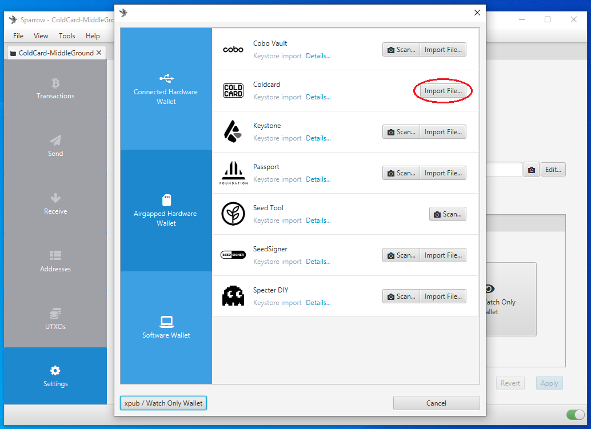

After a moment, you will see a summary of the wallet you are about to apply. You will notice a "Master fingerprint" dialog box with 8-characters in it. You can use this unique identifier to confirm that you are importing the correct wallet from your COLDCARD. 

On your COLDCARD, from the main menu, navigate down to `Advanced` > `View Identity` and you can compare the displayed fingerprint to the one displayed in Sparrow Wallet. This is especially important to confirm if you have added a passphrase which will be covered in the [Paranoid guide](https://github.com/econoalchemist/ColdCard-Paranoid)

If everything looks good, then click on <kbd>Apply</kbd> in Sparrow Wallet. 

  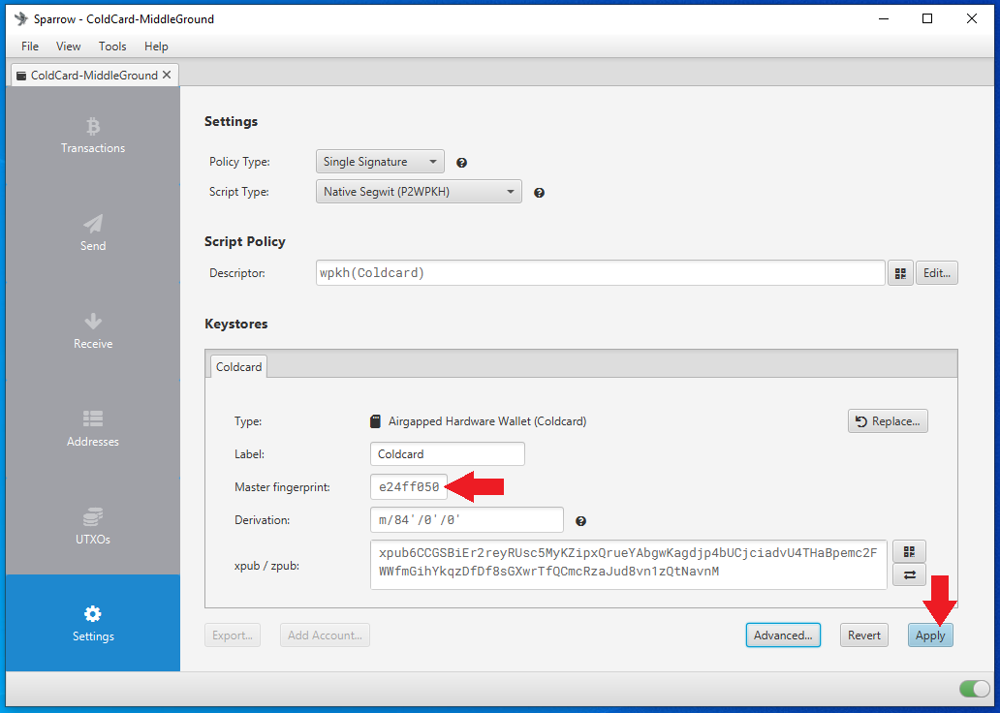
  

After clicking on <kbd>Apply</kbd>, you will have the opportunity to add a password to your wallet. This is a password which will encrypt the Sparrow Wallet data file that is saved on your computer. This password can protect your wallet if someone else gains access to your desktop and Sparrow Wallet file. If you forget your password, you will need to create a new wallet file by repeating this whole process. 

  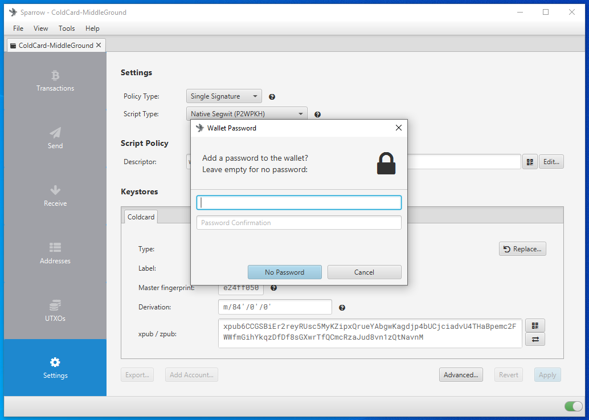

You can also save a list of deposit addresses from your COLDCARD and compare this saved list to Sparrow Wallet to ensure the correct wallet is loaded without having to retrieve your COLDCARD, login to it, and compare the deposit addresses there. To do this, select the `Receive` tab in Sparrow Wallet then you can view the first receiving address from your COLDCARD and its QR code. On your COLDCARD, make sure you insert the microSD card and enter your passphrase if applicable. Then from the main menu, select `Address Explorer`. This will bring up a few address types that you can choose to view. Your COLDCARD can use legacy P2PKH Bitcoin addresses that start with "1", or nested SegWit P2SH Bitcoin addresses that start with "3", or Native SegWit Bech32 Bitcoin addresses that start with "bc1". Then you want to press <kbd>1</kbd> and this will save the first 250 addresses to a `.csv` file on your microSD card. You can also open the `addresses.csv` file with a text editor on your desktop to view the 250 addresses you exported from your COLDCARD and compare them to your Sparrow Wallet just for the added assurance. 

  

After applying the changes, you can now navigate through your watch-only wallet in Sparrow Wallet. On the left-hand side of the Sparrow Wallet interface there are six tabs. The <kbd>Transactions</kbd> tab is where you can see information related to the transactions in this watch-only wallet. The <kbd>Send</kbd> tab is where you can create the PSBTs to then export for signing by the COLDCARD. The <kbd>Receive</kbd> tab is where you can generate receive address for your COLDCARD without having to plug in your COLDCARD and log into it. The <kbd>Addresses</kbd> tab shows several deposit and change addresses as well as any balances. The <kbd>UTXOs</kbd> tab shows any unspent transaction outputs and a small graph charting the history. Finally, the <kbd>Settings</kbd> tab is where you can see detailed information about the watch-only wallet such as the master fingerprint, derivation path, & xpub.   

Now you can click on the <kbd>Receive</kbd> tab on the left-hand side of the Sparrow Wallet interface. Then you will be presented with a bitcoin receiving address, a QR code, and some additional details. You can scan this QR code with your mobile Bitcoin wallet, for example, and deposit some bitcoin to your COLDCARD. You should see the transaction show up in Sparrow Wallet after a moment along with a pop-up notification. Also, in BitcoinCore, the transactions should show up there as well. The transaction will remain in a pending status until it receives some blockchain confirmations. In the mean-time, you can click on the <kbd>Transactions</kbd> tab and review further details about your transaction. You can also copy/paste your transaction ID in [mempool.space](https://mempool.space/) to watch for your first confirmation, or use whatever your preferred block explorer is. [Tor Browser](https://www.torproject.org/download/) is a privacy-focused browser.  

  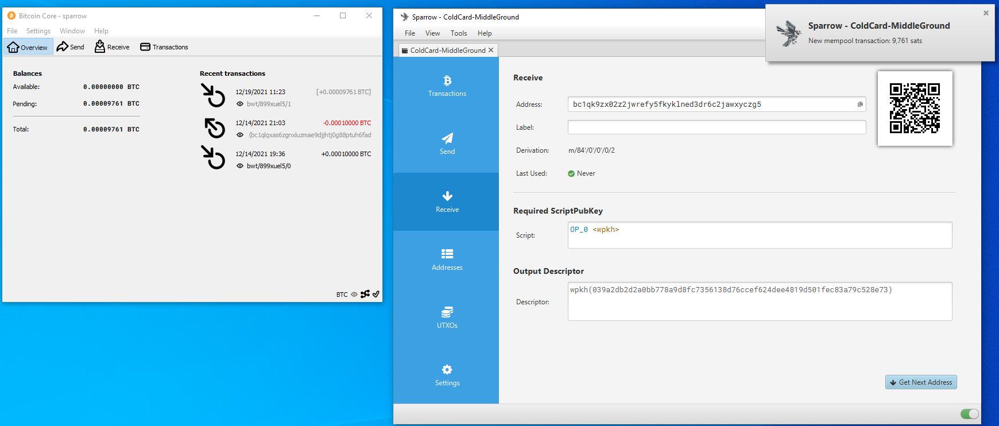
  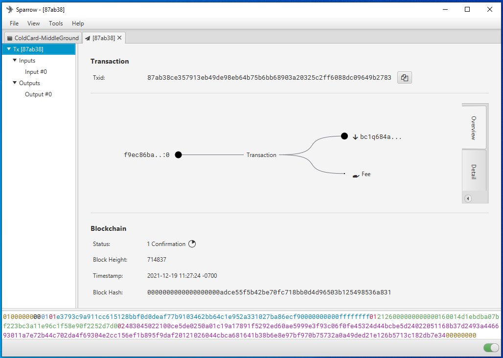
  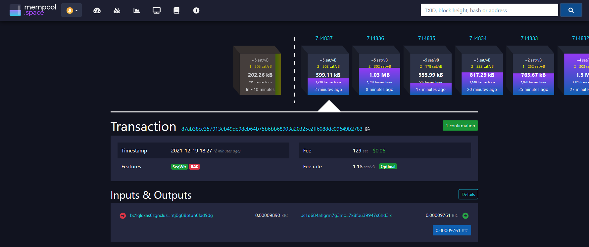
  

Now you can power off and secure your COLDCARD in a safe place until you want to sign a transaction and spend from it, several addresses will be cataloged in Sparrow Wallet so you can continue depositing to your COLDCARD via Sparrow Wallet without having to reconnect it every time. It is best practice to confirm each receiving address on the COLDCARD itself and or your saved `.csv` file and additionally to only use each address once. 

When you are ready to sign a transaction to spend bitcoin, it is necessary to create a PSBT in order to maintain the air-gapped benefit. You can deposit bitcoin with your COLDCARD disconnected but to spend bitcoin, the COLDCARD needs to sign the transaction. Sparrow Wallet is used to build the transaction based on your available Unspent Transaction Outputs (UTXOs) and the information you enter when constructing the transaction. The PSBT details are passed between Sparrow Wallet and the COLDCARD using the microSD card. 

To create a PSBT, navigate to the <kbd>Spend</kbd> tab on the left-hand side in Sparrow Wallet. There, you can paste the address you are sending to, add a label, enter an amount to send, and choose a miners fee rate, etc. Once you have everything set, click on <kbd>Create Transaction</kbd>. On the next screen, double check the details then click on <kbd>Finalize Transaction for signing</kbd>. Then you will be asked what you want to do with the finalized PSBT. In this case, click on <kbd>Save Transaction</kbd> and Sparrow Wallet will launch the file explorer. Navigate to the microSD card and save the PSBT there. Then safely eject the microSD card.  

  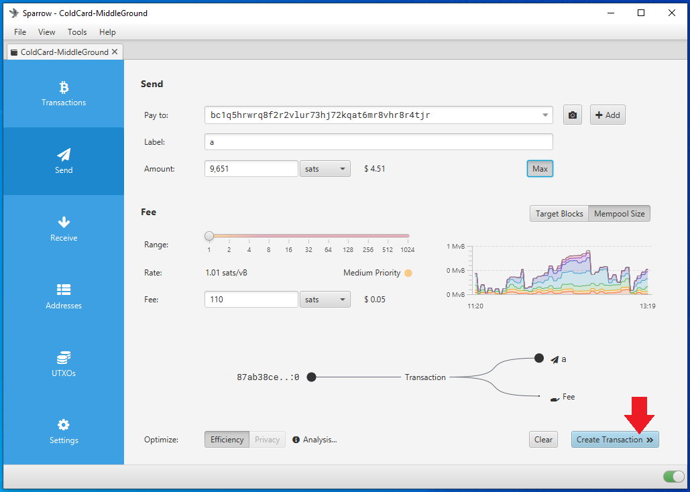
  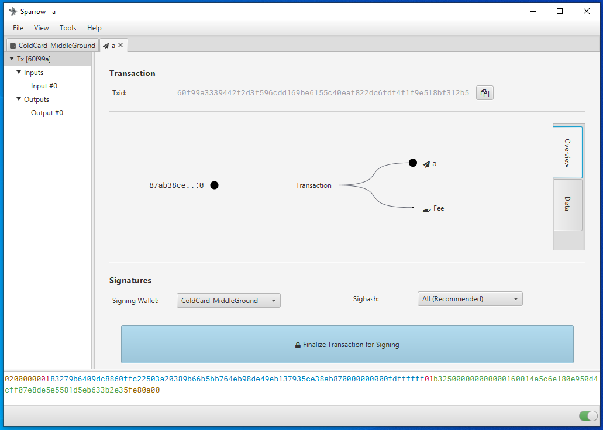
  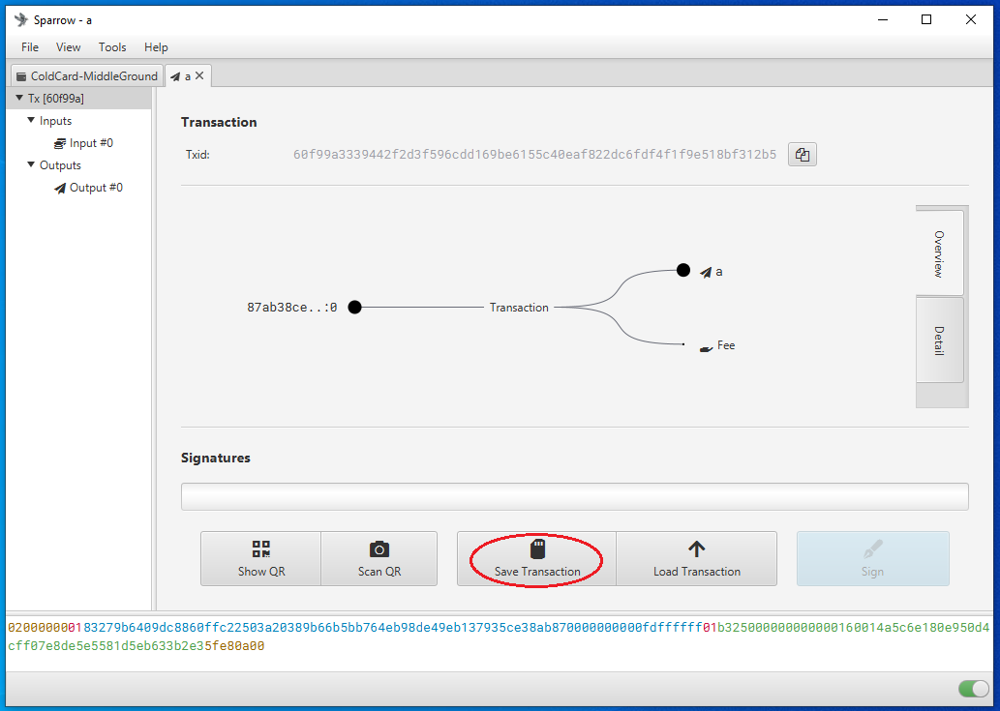
  

  
Insert the microSD card into the COLDCARD. If necessary, power on your COLDCARD using the COLDPOWER 9v battery adaptor or USB adaptor. Then enter your COLDCARD PIN prefix, verify your anti-phishing words, and enter the PIN suffix. From the main menu choose `Ready to Sign`. Then the details of the PSBT will be displayed and you can confirm that the address and the amount and the miners fee are correct.    

  
  
  
  

  
Then hit <kbd>OK</kbd> to sign. Once the file is signed it will be saved as a new file to the microSD card. You can then eject the microSD card and securely log out of your COLDCARD and power it down. 
 

  

Eject the microSD card from the COLDCARD, insert to the USB adaptor, insert the adaptor into the desktop computer. Ensure BitcoinCore and Sparrow Wallet are open. Then from the file explorer, simply double-click on the signed PSBT file and it should open automatically in Sparrow Wallet. Alternatively, from Sparrow Wallet navigate to `File` > `Open Transaction` then choose `File` from the menu of options and navigate to the file location of the signed PSBT. Either way, then click on the <kbd>Broadcast Transaction</kbd> button to send the signed transaction to the Bitcoin Network. 

  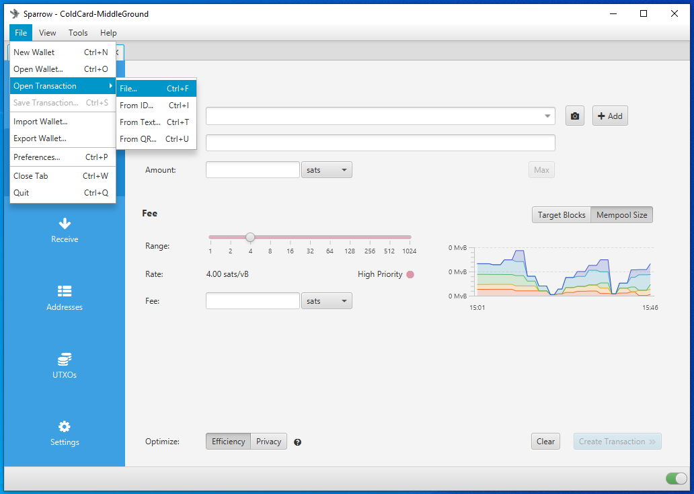
  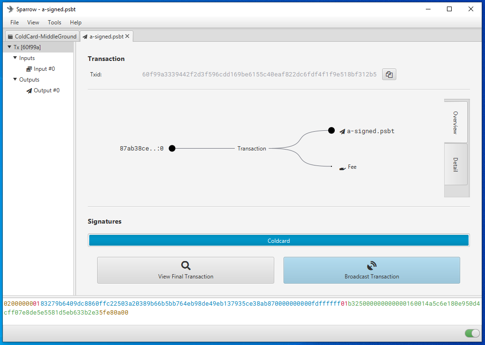

                                                          
At the time of broadcast you should see the transaction in BitcoinCore as well as receive a notification in Sparrow Wallet. Again, you can copy the transaction ID and paste in your preferred block explorer to watch for confirmations.
                                                          

  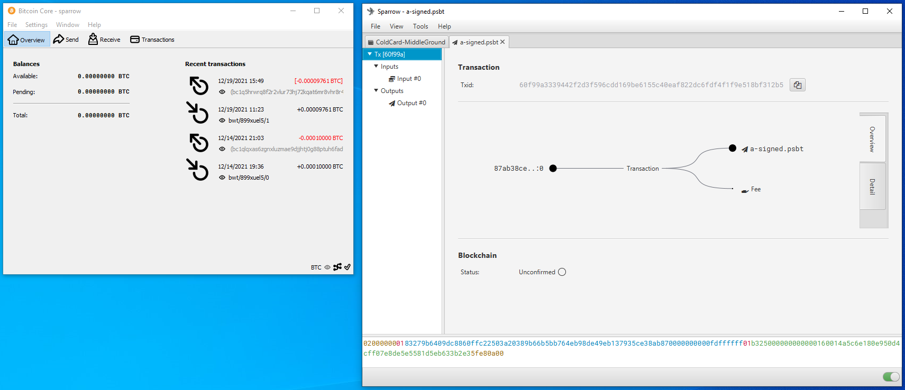

The main point here is that your COLDCARD is the required signing device while your Sparrow Wallet is your interface, transaction builder, & broadcaster. In this configuration, Sparrow Wallet can do many things like catalog addresses and build transactions but without the signature from your COLDCARD, Sparrow Wallet cannot authorize spending of any of your bitcoin. 

## Backup recommendations
Careful considerations should be made in regards to how the wallet backup information will be stored. The information required for a proper backup varies depending on how the wallet was setup. These requirements may be only 24-words for a simple wallet or the requirements can include 24-words, a passphrase, master fingerprint, derivation path, and more. There are several options when it comes to picking a storage medium, each has its own set of tradeoffs. Writing the 24-words on paper is a good start and helps mitigate the risks associated with having a digital copy of the backup information. With the backup information written down on paper, an adversary would need physical access to the paper in order to retrieve the information. Where as a photo, text file, or other digital medium can be copied and replicated and shared quickly. 

The trade off with paper backups is that they do not withstand fire or flooding very well. This is where steel backups come into play. Robust backups made from stainless steel can withstand fire temperatures beyond the range of a typical house fire, up to 1,500°C. Also stainless steel backups can withstand being submerged in water for extended periods of time. There is a wide range of steel backups available. Coinkite offers the [SEEDPLATE](http://bitcoinseedbackup.com/) which gives users a robust backup option that is resistant to fire and flooding as well as easy to conceal.   

  
  

These stainless steel plates are etched with a grid on both sides. The grid contains the alphabet along the Y-axis and 48-columns along the X-axis. The 48-columns are split into 12 groups of 4-columns. Each of the 12-groups has enough room for 4-letters. Only the first 4-letters of each BIP39 seed word is required in order to restore the wallet as no two words on the BIP39 word list share the same sequence of the first 4-letters. 

Use a marker to indicate the first 4-letters of the first 12-words on one side of the plate and then flip the plate over and repeat the process for the 13th through 24th words. Double check your work then use a spring-loaded punch to stamp the plate on each mark.

  
  

Now you have a robust stainless steel backup that can withstand fire and flood. This backup plate is easy to conceal measuring in at 127mm X 76mm x 1.5mm so that it can be hidden in a variety of places and environments. 

## Conclusion
That is all for this guide. You should have the knowledge now to check your tamper-evident bag, setup a PIN, create & backup a seed phrase created with some of your own randomness, as well how to import a watch-only wallet to Sparrow wallet and make some air-gapped transactions, and have some ideas about steel backup solutions. Both COLDCARD and Sparrow Wallet have more advanced features which you can learn about in the [Paranoid](https://www.github.com/econoalchemist/ColdCard-Paranoid/) guide. Be sure to power down your COLDCARD, disconnect it, and secure it in a safe place and keep your backup information in a separate location.   
